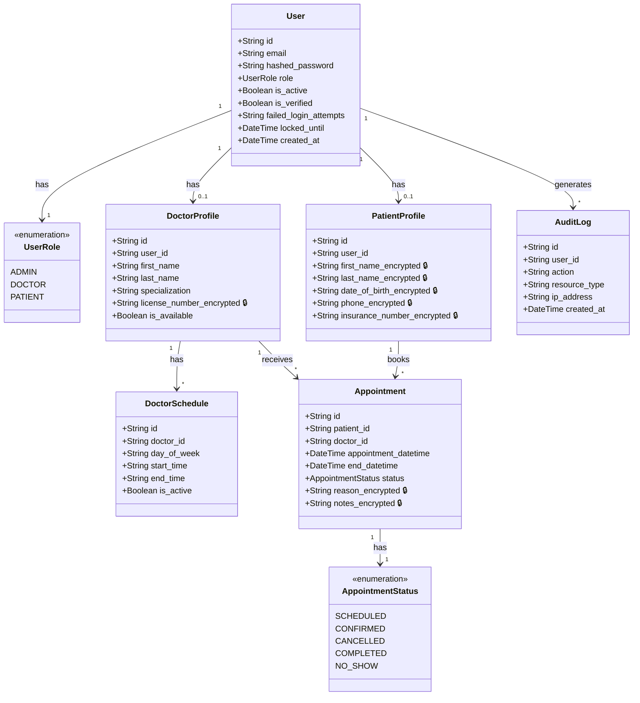
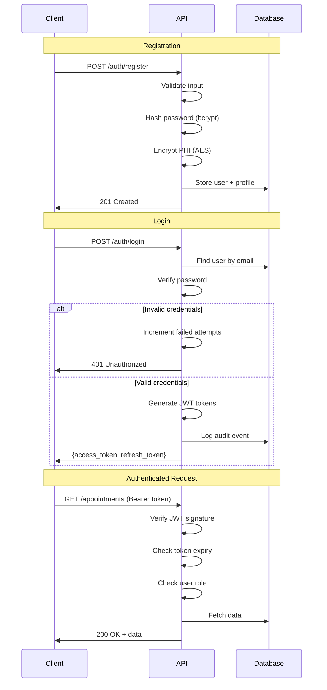
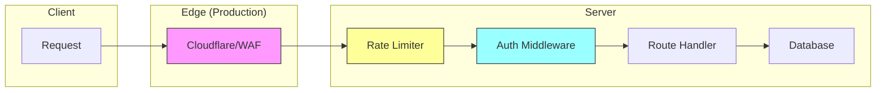
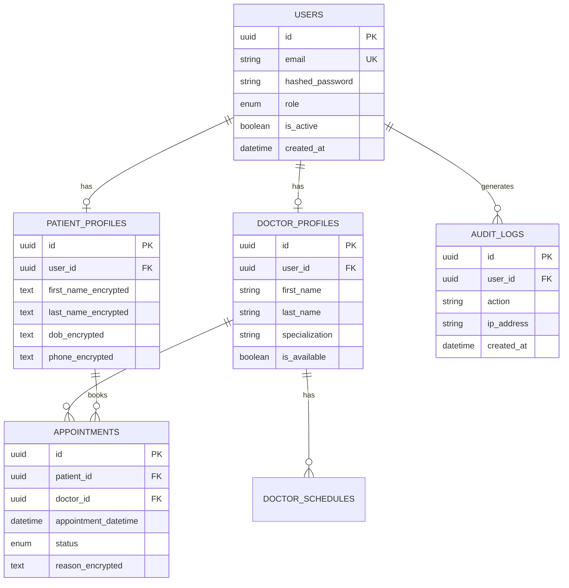
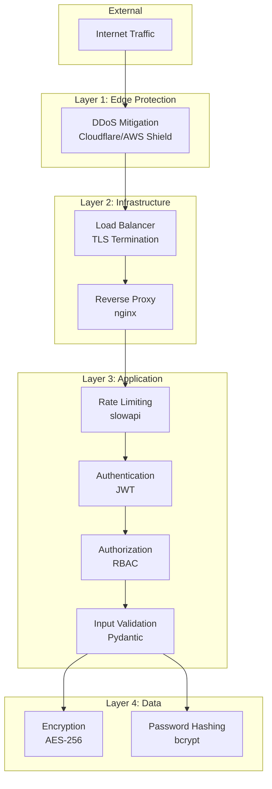

# Architecture Documentation

## Class Diagram

```mermaid
classDiagram
    direction TB
    
    %% User & Authentication
    class User {
        +String id
        +String email
        +String hashed_password
        +UserRole role
        +Boolean is_active
        +Boolean is_verified
        +String failed_login_attempts
        +DateTime locked_until
        +DateTime created_at
    }
    
    class UserRole {
        <<enumeration>>
        ADMIN
        DOCTOR
        PATIENT
    }
    
    class PatientProfile {
        +String id
        +String user_id
        +String first_name_encrypted 🔒
        +String last_name_encrypted 🔒
        +String date_of_birth_encrypted 🔒
        +String phone_encrypted 🔒
        +String insurance_number_encrypted 🔒
    }
    
    class DoctorProfile {
        +String id
        +String user_id
        +String first_name
        +String last_name
        +String specialization
        +String license_number_encrypted 🔒
        +Boolean is_available
    }
    
    class DoctorSchedule {
        +String id
        +String doctor_id
        +String day_of_week
        +String start_time
        +String end_time
        +Boolean is_active
    }
    
    class Appointment {
        +String id
        +String patient_id
        +String doctor_id
        +DateTime appointment_datetime
        +DateTime end_datetime
        +AppointmentStatus status
        +String reason_encrypted 🔒
        +String notes_encrypted 🔒
    }
    
    class AppointmentStatus {
        <<enumeration>>
        SCHEDULED
        CONFIRMED
        CANCELLED
        COMPLETED
        NO_SHOW
    }
    
    class AuditLog {
        +String id
        +String user_id
        +String action
        +String resource_type
        +String ip_address
        +DateTime created_at
    }
    
    User "1" --> "1" UserRole : has
    User "1" --> "0..1" PatientProfile : has
    User "1" --> "0..1" DoctorProfile : has
    User "1" --> "*" AuditLog : generates
    DoctorProfile "1" --> "*" DoctorSchedule : has
    DoctorProfile "1" --> "*" Appointment : receives
    PatientProfile "1" --> "*" Appointment : books
    Appointment "1" --> "1" AppointmentStatus : has
```

> 🔒 = AES-256 encrypted field

## Authentication Flow

```mermaid
sequenceDiagram
    participant C as Client
    participant A as API
    participant DB as Database
    
    Note over C,DB: Registration
    C->>A: POST /auth/register
    A->>A: Validate input
    A->>A: Hash password (bcrypt)
    A->>A: Encrypt PHI (AES)
    A->>DB: Store user + profile
    A->>C: 201 Created
    
    Note over C,DB: Login
    C->>A: POST /auth/login
    A->>DB: Find user by email
    A->>A: Verify password
    alt Invalid credentials
        A->>A: Increment failed attempts
        A->>C: 401 Unauthorized
    else Valid credentials
        A->>A: Generate JWT tokens
        A->>DB: Log audit event
        A->>C: {access_token, refresh_token}
    end
    
    Note over C,DB: Authenticated Request
    C->>A: GET /appointments (Bearer token)
    A->>A: Verify JWT signature
    A->>A: Check token expiry
    A->>A: Check user role
    A->>DB: Fetch data
    A->>C: 200 OK + data
```

## Request Flow

```mermaid
flowchart LR
    subgraph Client
        A[Request]
    end
    
    subgraph Edge["Edge (Production)"]
        B[Cloudflare/WAF]
    end
    
    subgraph Server
        C[Rate Limiter]
        D[Auth Middleware]
        E[Route Handler]
        F[Database]
    end
    
    A --> B
    B --> C
    C --> D
    D --> E
    E --> F
    
    style B fill:#f9f,stroke:#333
    style C fill:#ff9,stroke:#333
    style D fill:#9ff,stroke:#333
```

## Database Schema

```mermaid
erDiagram
    USERS ||--o| PATIENT_PROFILES : has
    USERS ||--o| DOCTOR_PROFILES : has
    USERS ||--o{ AUDIT_LOGS : generates
    
    DOCTOR_PROFILES ||--o{ DOCTOR_SCHEDULES : has
    DOCTOR_PROFILES ||--o{ APPOINTMENTS : receives
    PATIENT_PROFILES ||--o{ APPOINTMENTS : books
    
    USERS {
        uuid id PK
        string email UK
        string hashed_password
        enum role
        boolean is_active
        datetime created_at
    }
    
    PATIENT_PROFILES {
        uuid id PK
        uuid user_id FK
        text first_name_encrypted
        text last_name_encrypted
        text dob_encrypted
        text phone_encrypted
    }
    
    DOCTOR_PROFILES {
        uuid id PK
        uuid user_id FK
        string first_name
        string last_name
        string specialization
        boolean is_available
    }
    
    APPOINTMENTS {
        uuid id PK
        uuid patient_id FK
        uuid doctor_id FK
        datetime appointment_datetime
        enum status
        text reason_encrypted
    }
    
    AUDIT_LOGS {
        uuid id PK
        uuid user_id FK
        string action
        string ip_address
        datetime created_at
    }
```

## Security Layers

```mermaid
flowchart TB
    subgraph External
        A[Internet Traffic]
    end
    
    subgraph Edge["Layer 1: Edge Protection"]
        B[DDoS Mitigation<br/>Cloudflare/AWS Shield]
    end
    
    subgraph Infra["Layer 2: Infrastructure"]
        C[Load Balancer<br/>TLS Termination]
        D[Reverse Proxy<br/>nginx]
    end
    
    subgraph App["Layer 3: Application"]
        E[Rate Limiting<br/>slowapi]
        F[Authentication<br/>JWT]
        G[Authorization<br/>RBAC]
        H[Input Validation<br/>Pydantic]
    end
    
    subgraph Data["Layer 4: Data"]
        I[Encryption<br/>AES-256]
        J[Password Hashing<br/>bcrypt]
    end
    
    A --> B --> C --> D --> E --> F --> G --> H --> I & J
```
